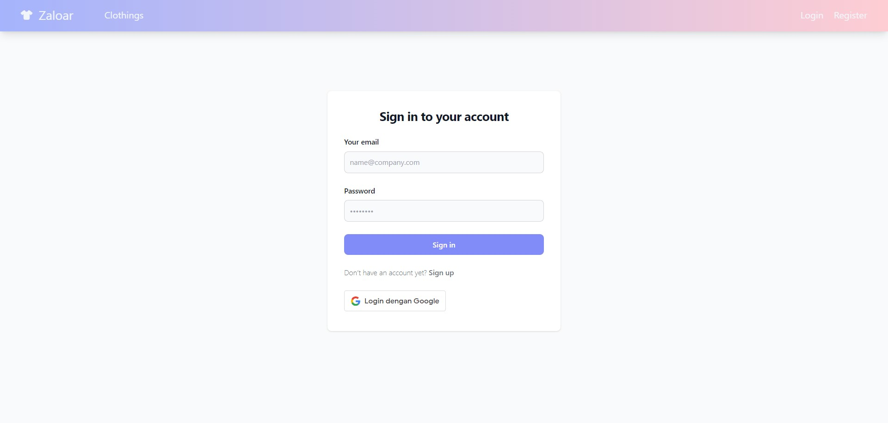
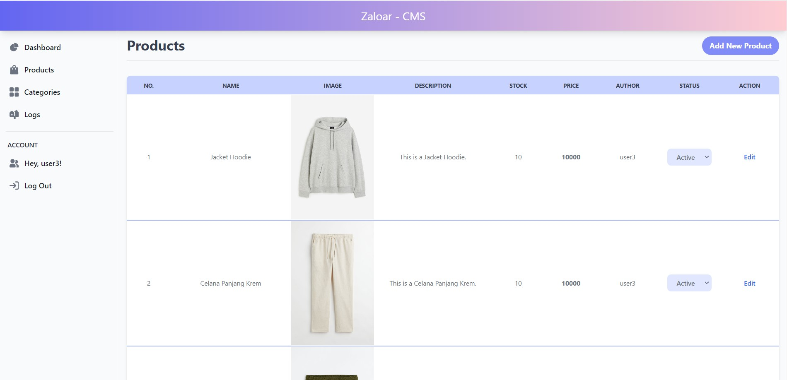
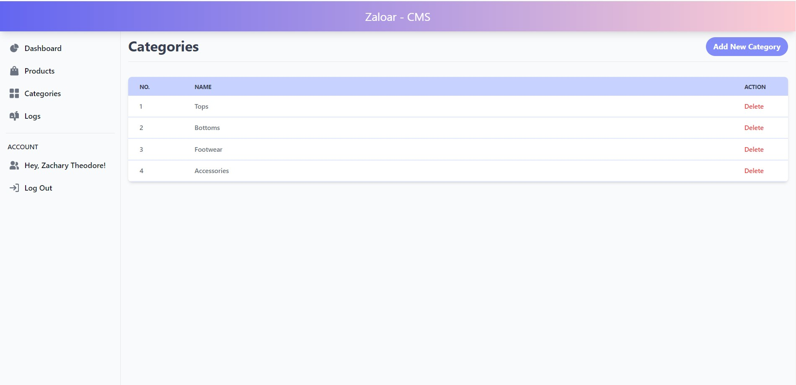
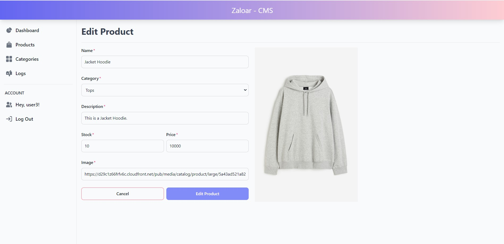
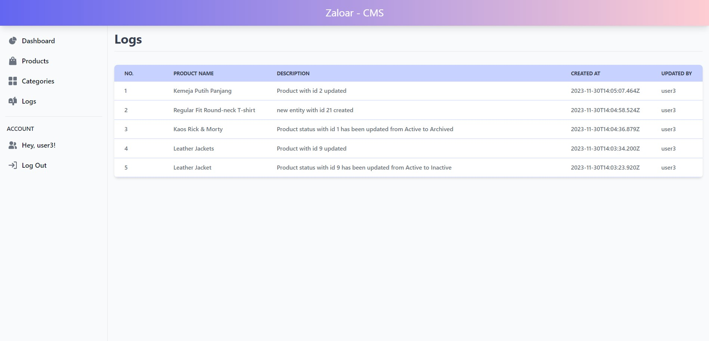
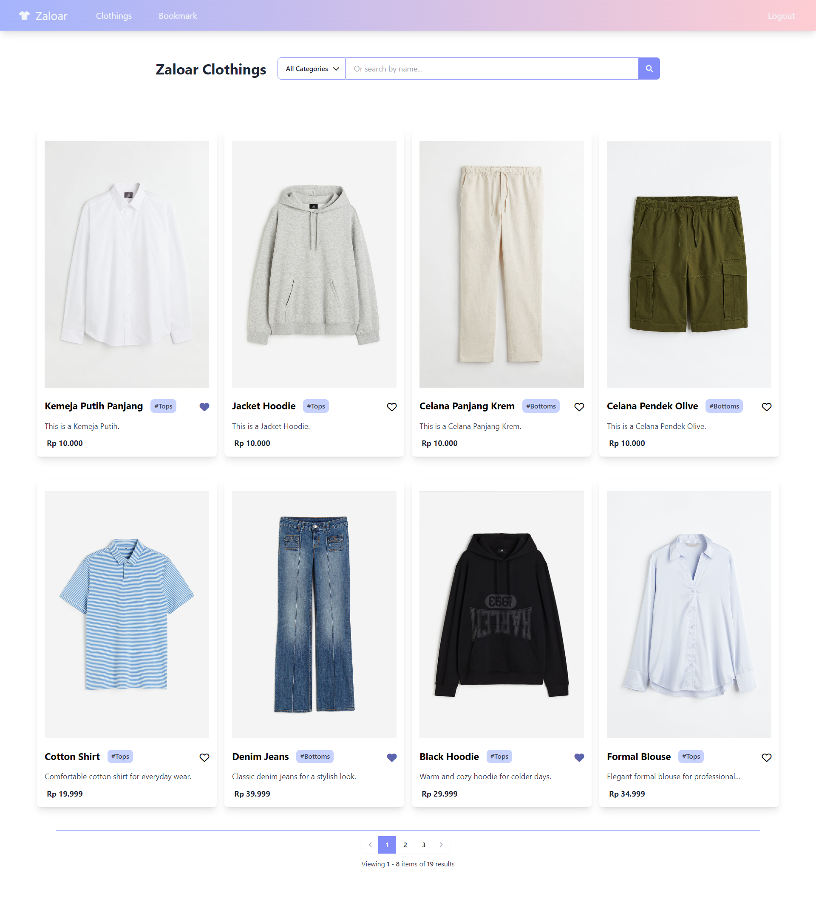
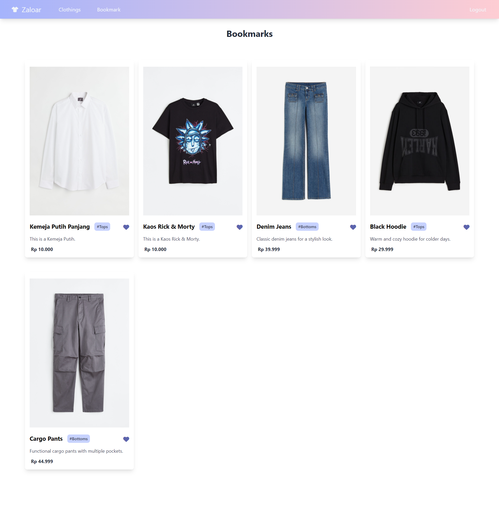

# Zaloar

This project consisted of two websites:

- Public facing website for user to browse clothing collection (has pagination), see product detail, and add bookmark to their favorite fashion item
- Admin CMS with authentication and authorization.Admin can to see list of items, change its status (changing item's availability to be shown at the public website), add, and edit item. Every admin activity can be seen in history page.

Tech Stack Used:

- Front-end: VueJs, Pinia, HTML,CSS, Tailwind
- Back-end: ExpressJs, Sequelize, GoogleAuth, NodeJS, PostgreSQL
- Deployment: AWS, Firebase

Video Links:

- Public site: https://drive.google.com/file/d/1MKOZq4H_jZNF4ZlQxj_Nq0UbH0O6kzJj/view?usp=sharing
- Admin site: https://drive.google.com/file/d/1lJyvaoGQKYafBGs3wOTOWi8cEUmrBYn8/view?usp=sharing

# Admin CMS:

#### login:

#### item list:

#### category list:

#### item form:

#### histories:

# Public site:

#### homepage:

#### bookmark page:

